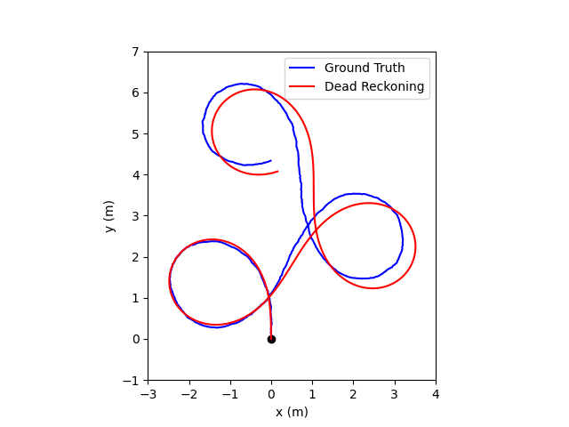
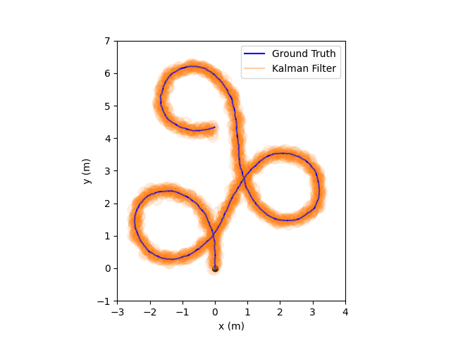

# 16-362 Assignment 2: Mapping and Localization

Goal: In this assignment, you will implement data structures and algorithms
for occupancy grid maps, range sensors, and filtering-based localization.
These methods are widely deployed in the robotics industry.

There are two subdirectories in this handout: `mapper_py` and `state_est_py`.
The `mapper_py` directory will contain the occupancy grid map implementation that
you will create through this assignment. Likewise, `state_est_py` will contain
all python scripts that enable filtering-based localization.

### Setup
Create a python virtual environment.
```bash
python3.8 -m .venv venv
```
Source the environment
```bash
source .venv/bin/activate
```
You will need to install the following dependencies.
```bash
pip install cprint numpy matplotlib opencv-python
```

## 1. Occupancy Grid Mapping (60 points)
The occupancy grid map is a spatial grid where each cell denotes the occupancy
state for all the points within that cell. In the first part of this assignment,
our goal is to implement an occupancy grid mapping system. To simplify the problem,
we make the following assumptions:
- The robot is perfectly localized on a 2D plane
- The robot size is negligible ("point" robot) and it can move in any direction on a 2D plane

To create a 2D map of the environment, we first need to create a data structure
to store and query occupancy values.

### 1.1 Grid Data Structure (30 points)
In this section, we will write the class `Grid2D` that implements a data
structure for such a grid for 2D environments.

Open the Python script `mapper_py/data_structures/grid.py`. You will see several class definitions.

1. `Cell`: A single cell in the occupancy grid map.
2. `Point`: A point in the 2D space.
3. `Grid2D`: Occupancy grid data structure.

All of the graded parts of this part are within the `Grid2D` class. These
parts are marked by `TODO` and are necessary to complete for full credit.

1. `to_index`: Get the index in the `Grid2D` object for the input `cell` object.
2. `from_index`: Get the `Cell` corresponding to an index `idx`.
3. `get`, `get_cell`, `get_row_col`: Get the occupancy data at the input index `idx` or cells.
4. `set`, `set_cell`, `set_row_col`: Set the occupancy data at the input index `idx` (or cells) to `value`.
5. `probability`: Convert logodds represention to probability.
6. `logodds`: Convert probability representation to logodds.
7. `cell_to_point`, `cell_to_point_row_col`: Get the lower left hand corner of the input `cell` in the 2D point space. In a grid of resolution `0.1`, the lower left hand corner of the cell `(row = 70, col = 20)` corresponds to the point `(x=0.2, y=0.7)`. This is in contrast to the center point of the cell which is `(x=0.25, y=0.75)`.
8. `point_to_cell`: Get the `Cell` corresponding to the input 2D point.
9.  `inQ`: Check if the input 2D point is in the grid bounds or not.
10. `traverse`: Given a line segment (start and end points), return a tuple (`success`, `raycells`)
where `success` is a bool indicating whether the traversal through the grid was successful and `raycells`
is a list of cells that were traversed if successful. You may find the paper by Amanatides and Woo [1]
to be useful for this part.

**Debugging and Grading**
We have provided a testing script `mapper_py/grid_test.py`. It contains two
functions that we will use for autograding: `test_data_structure` and
`test_traversal`.

`test_data_structure` tests your solutions for `1` through `7` above. It reads one of the example
maps from the `test_data` subdirectory and creates a `Grid2D` object from it using the `png_to_grid2d`
method in `mapper_py/utils.py`. The grid is then visualized using the `visualize` method from
`mapper_py/utils.py`. `png_to_grid2d` and `visualize` internally call the methods `1` to `7` mentioned above.
Example output for:

```bash
python3 grid_test.py --map simple_obstacle
```
should look like:


In the terminal, you should see:
```txt
test_data_structure successful.
```

Additionally, there is a `office` map available for testing. In the autograder, we will
run several unseen maps to test the accuracy of your solution. Passing `test_data_structure`
is worth 10 points.

`test_traversal` tests your solutions for `8` through `10`. It creates an empty grid
of pre-specified parameters and then plots the traced cells for a given ray. In the
main function of `mapper_py/grid_test.py`, you will see several tests for this function
that test corner conditions such as: slopped rays, rays going outside of the map bounds, etc.
Example output (second figure) after running `python3 grid_test.py --map simple_obstacle`:


In the terminal, you should see:
```txt
traverse function succeeded, number of traced cells: 16
test_traversal successful.
traverse function succeeded, number of traced cells: 35
test_traversal successful.
traverse function succeeded, number of traced cells: 16
test_traversal successful.
traverse function succeeded, number of traced cells: 16
test_traversal successful.
traverse function succeeded, number of traced cells: 27
test_traversal successful.
traverse function succeeded, number of traced cells: 27
test_traversal successful.
traverse function succeeded, number of traced cells: 11
test_traversal successful.
traverse function succeeded, number of traced cells: 24
test_traversal successful.
traverse function succeeded, number of traced cells: 7
test_traversal successful.
traverse function succeeded, number of traced cells: 21
test_traversal successful.
```

There are several different tests with changed start and end points that will be used within
the autograder to test the accuracy of your solution. Passing `test_traversal` is worth
20 points.

### 1.2 Range Sensor (10 points)
We will now create a simple geometric model of a range sensor. We will assume that the range sensor
is mounted on a point (i.e., negligible size) robot.

Look at the file `mapper_py/data_structures/sensor.py`. There are two classes defined, `Ray` and `Sensor`.

The `Ray` class implements, as expected, a ray with an origin and a direction. You have to fill the function
`point_at_dist` that returns a `Point` along the ray for the input distance `t`.

The `Sensor` class implements a geometric model for the range sensor with a maximum range `max_range` and
total number of rays `num_rays`. You have to implement the `rays` method which generates `num_rays` number
of rays around the given position `pos` at equal angular intervals within `[0, 2.0 * np.pi]` (i.e., 0 to 360 degrees).
Do not double count `0.0` and `2.0 * np.pi` (Hint: Utilize the `endpoint` option in the `np.linspace` function.)

**Debugging and Grading**
We have provided a testing script `mapper_py/sensor_test.py`. Running this script will plot
all the rays at the position `Point(1.23, 3.2)` on an empty grid.

The output of
```bash
python sensor_test.py
```
should look like


and
```text
sensor_test successful.
```
should print out in the terminal.

### 1.3 Occupancy Mapping (20 points)
Now we create a class called `Mapper` in `mapper_py/mapper.py` to put these elements together to
perform occupancy grid mapping via logodds update.

You have to implement the methods `update_logodds`, `update_miss`, `update_hit`, and `add_ray`
in this part. The instructions are provided in the docstrings for each of the functions.

**Debugging and Grading**
We have provided a testing script `mapper_py/mapper_test.py`. Running this script will show
an animation of the occupancy grid map being created using ray observations of the environment.
There is also a quantitative test included.

After running
```bash
python mapper_test.py
```
the final figure for `simple_obstacle` map will look like


the final figure for `office` map will look like


and the terminal printouts will be

```txt
Running qualitative test on simple_obstacle map
Running quantitative test on simple_obstacle map
Quantitative test successful for simple_obstacle map.
Running qualitative test on office map
Running quantitative test on office map
Quantitative test successful for office map.
```

## 2. Filtering-based Localization (40 points)
So far, we have assumed that the position of the robot is perfectly known. In this part
of the assignment, we will create a localization system for a differential drive robot.
There is no global positioning system available for our robot and we must reliably estimate
its state using a noisy GPS sensor.

### Differential Drive Robot

<p align="center">
  
</p>

A wheeled robot equipped with a differential drive contains two main wheels controllable
through motors. Let us understand the kinematic model for such a robot. The state
of this robot at any time $t$ can be written using the vector

$$
\mathbf{x} = \begin{bmatrix}x \\
y \\ 
\psi 
\end{bmatrix},
$$

where $x$ and $y$ are the coordinates of the robot in the 2D point space, $\psi$
is the angle between the robot's x-axis and the global x-axis (see the
illustration above). The control input applied to the wheels is denoted using
the vector

$$\mathbf{u} = \begin{bmatrix}u_L \\
u_R
\end{bmatrix}.
$$

The time derivative of the state vector is given by

$$
\dot{\mathbf{x}} \coloneqq f(\mathbf{x}, \mathbf{u}) = \begin{bmatrix} \frac{r}{2} \cos{\psi} & \frac{r}{2} \cos{\psi}\\
\frac{r}{2} \sin{\psi} & \frac{r}{2} \sin{\psi} \\
-\frac{r}{L} & \frac{r}{L}
\end{bmatrix}
\begin{bmatrix} u_L \\
u_R
\end{bmatrix},
\tag{1}
$$

where $r$ is the radius of each wheel and $L$ is the distance between the two wheels (axle length). 

Equation 1 shows the continuous-time kinematics for the differential drive
wheeled robot.  However, we will be working with discrete-time kinematics. In
the discrete-time paradigm, we study the robot's kinematics at any *timestep*
instead of any *time*.  We have to discretize time into equally sized intervals.
Let the size of one such interval be $\Delta t$.  As $\Delta t \rightarrow 0$,
discrete-time kinematics tends towards continuous-time kinematics.

A key question then is: How to convert the continuous-time kinematics in Eq. 2
to the discrete-time case? This cannot be done analytically and we need a
numerical approximation. Here we use a first-order approximation of the
continuous-time case using the Euler's method for numerical integration. Given
the state at timestep $t-1$, the state at timestep $t$ is expressed as
  
$$
\mathbf{x}\_{t} = \mathbf{x}\_{t-1} + f( \mathbf{x}\_{t-1}, \mathbf{u}\_{t} ) \Delta t.
\tag{2}
$$

In Eq. 1, we assumed that there is no noise from the environment affecting robot's state. This is
a major assumption because most of the robotics application in real-world are prone to *process* noise.
For example, if a wheeled robot is navigating on a rough surface, it's state might be affected from
the oscillations due to uneven bumps in the surface.

Accounting for the process noise, we get the continuous-time kinematics model of the robot:

$$
\dot{\mathbf{x}} = g( \mathbf{x}, \mathbf{u}, \mathbf{w} ),
\tag{3}
$$

where the function $g(\mathbf{x}, \mathbf{u}, \mathbf{w})$ is essentially a combination of the function
$f(\mathbf{x}, \mathbf{u})$ and the process noise variable $\mathbf{w}$. Typically this combination is
unknown for any robotic system. Thus, state estimation strategies impose assumptions on how the function
$g(\mathbf{x}, \mathbf{u}, \mathbf{w})$ is related to $f(\mathbf{x}, \mathbf{u})$ and $\mathbf{w}$.

Before we study estimators that account for process noise and sensing data, let us implement a
naive state estimation method that ignores these aspects.

### 2.1 Dead Reckoning (DR) (10 points)
To get state estimate at any time $t$, why not just integrate the kinematics
over time? The process of estimating the state only based on the kinematics,
without using any sensing data and noise handling, is known as Dead Reckoning (DR).

For DR, Eq. 2 is approximated as

$$
g(\mathbf{x}, \mathbf{u}) = \mathbf{x} + f(\mathbf{x}, \mathbf{u}) \Delta t
\tag{4}
$$

At any $t$, we want to estimate the state $\hat{\mathbf{x}}\_t$. We are given the estimated
state $\hat{\mathbf{x}}\_{t-1}$ at the previous timestep $t-1$ and the current control input to the
system $\mathbf{u}\_t$. Using the definition of $g(\mathbf{x}, \mathbf{u})$ in Eq. 3 above, the
state estimate is obtained in DR using:

$$
\mathbf{x}\_t = \mathbf{x}\_{t-1} + g(\mathbf{x}\_{t-1}, \mathbf{u}\_t) \Delta t
\tag{5}
$$

Open `state_est_py/estimator.py` and implement Eq. 5 in the `dead_reckoning` method within the `Estimator` class.

**Debugging and Grading**
We have provided the `state_est_py/estimator_test.py` script for testing.
Please look through the function `dead_reckoning_test` and try to follow what it
is doing. It uses the ground truth data `test_data/dead_reckoning_test.npz`
(i.e., the real states $(\mathbf{x}\_0, \mathbf{x}\_1, \ldots, \mathbf{x}\_{N-1})$
of the robot due to the control input sequence $(\mathbf{u}\_0, \mathbf{u}\_1,
\ldots, \mathbf{u}\_{N-1})$ provided to the wheels of the robot). In our ground
truth data collection process (which we will not reveal), we have added some
noise to the process model of the robot.  In DR, as state earlier, you are not
supposed to account for any noise.

A correct implementation for DR will result in a plot that looks like this:



and in the terminal you should see

```txt
dead reckoning test successful.
```

Looking at the figure above, it is clear that dead reckoning is not providing
good estimates for the robot. This is because we have ignored using any sensors
that may be onboard the robot (e.g., GPS) and we have not accounted for the
process noise $\mathbf{w}$.

### 2.2 Kalman Filter (KF) (20 points)
Let us assume that our wheeled robot is operating outdoors on a rough terrain. Due to
the rough terrain, the actual motion of the robot suffers from unknown perturbations (i.e., the
unknown process noise $\mathbf{w}$). There is a GPS sensor mounted on the robot that provides
noisy estimates of the x and y coordinates of the robot (i.e., directly observes the $x$ and
$y$ elements of the state vector $\mathbf{x}$).

To improve upon dead reckoning, we need a way to account for the unknown
$\mathbf{w}$ and enable incorporate sensor-based feedback using the GPS sensor.
Note that the GPS sensor might also have unknown noise characteristics.

Let us try to solve this problem using a *Kalman filter* [2]. The Kalman filter
requires us to make several assumptions:
1. The process model $g(\mathbf{x}, \mathbf{u}, \mathbf{w})$ needs to be a linear function of
$\mathbf{x}$, $\mathbf{u}$, and $\mathbf{w}$. The models for any sensors used for estimation also
need to be linear (in our case it is the GPS sensor).
2. Any noise in the system or the sensor must be assumed to be distributed
according to a Gaussian (or Normal) distribution.

Notice from Eqs. 1 and 3 that the process model $g(\mathbf{x}, \mathbf{u},
\mathbf{w})$ is nonlinear with respect to $\mathbf{x}$. To mitigate this, we use
the process model in Eq. 2 and substitute the value of $f(\mathbf{x},
\mathbf{u})$ from Eq. 1 assuming that the angle $\psi$ is always fixed to the
value $\pi / 4$. Therefore, we will only estimate the states $x$ and $y$ in this example.
Later, in Extended Kalman Filter we will see how to mitigate this limitation.

The process noise $\mathbf{w} \sim \mathcal{N}(0, \mathbf{Q})$ is assumed to be
sampled from a Gaussian distribution with zero mean and covariance $\mathbf{Q}$.

Putting these pieces together, the final process model to be used for the Kalman filter is:

$$
\begin{bmatrix} x\_t \\
y\_t
\end{bmatrix} =
\begin{bmatrix} 1 & 0 \\
0 & 1
\end{bmatrix}
\begin{bmatrix} x\_{t-1} \\
y\_{t-1}
\end{bmatrix} +
\begin{bmatrix}
\Delta t \frac{r}{2} \cos{\psi} & \Delta t \frac{r}{2} \cos{\psi}\\
\Delta t \frac{r}{2} \sin{\psi} & \Delta t \frac{r}{2} \sin{\psi}
\end{bmatrix}_{\psi = \frac{\pi}{4}}
\begin{bmatrix} u\_L \\
u\_R
\end{bmatrix} +
\mathbf{w}\_t.
\tag{5}
$$

This equation can be written in a shorter form as

$$
\mathbf{x}\_t = \mathbf{A} \mathbf{x}\_{t-1} + \mathbf{B} \mathbf{u}\_t + \mathbf{w}\_t.
$$

The Kalman filter also requires a *measurement model*, a linear model for the sensor. We
will use the following model for our GPS sensor:

$$
\mathbf{y}\_t \coloneqq h(\mathbf{x}\_t, \mathbf{v}\_t) = \mathbf{C} \mathbf{x}\_t + \mathbf{v}\_t =
\begin{bmatrix}1 & 0 \\
0 & 1
\end{bmatrix} 
\mathbf{x}\_t + \mathbf{v}\_t.
$$

Here, $\mathbf{y}\_t$ is the current observation from the sensor,
$h(\mathbf{x}\_t, \mathbf{v}\_t)$ denotes the linear measurement model, and it is assumed that
the noise in the GPS sensor is Gaussian distributed, $\mathbf{v}\_t \sim \mathcal{N}(0, \mathbf{R})$,
with zero-mean and a covariance $\mathbf{R}$.

We now have all the elements to implement the Kalman filter. Note that the Kalman filter requires
the following inputs:
1. The process model noise covariance $\mathbf{Q}$.
2. The measurement model noise covariance $\mathbf{R}$.
3. An initial guess for the covariance associated with the state $\mathbf{P}\_0$.

The algorithm progresses as follows. At timestep $t$, we first estimate the state using
the process model,

$$
\hat{\mathbf{x}}\_t = \mathbf{A} \hat{\mathbf{x}}\_{t-1} + \mathbf{B} \hat{\mathbf{u}\_t},
\tag{6}
$$

followed by an update to the covariance (or uncertainty) estimate about this state:

$$
\mathbf{P}\_t = \mathbf{A} \mathbf{P}\_{t-1} \mathbf{A}^{\top} + \mathbf{Q}.
\tag{7}
$$

Notice how the process model noise is incorporated in the uncertainty estimate for the state.
Now, we need to incorporate the knowledge acquired through the GPS sensor while accounting for
the associated noise. We do this by computing what's called the *Kalman Gain*:

$$
\mathbf{K}\_{t} = \mathbf{P}\_t \mathbf{C}^{\top} (\mathbf{C} \mathbf{P}\_{t} \mathbf{C}^{\top} + \mathbf{R})^{-1}.
$$

The Kalman Gain is then used to correct the state estimate in-place, utilizing the latest
measurement from the GPS, $\mathbf{y}\_t$,

$$
\hat{\mathbf{x}}\_{t} \leftarrow \hat{\mathbf{x}}\_t + \mathbf{K}\_t (\mathbf{y}\_t - \mathbf{C}\hat{\mathbf{x}\_t}),
$$

followed by an in-place covariance correction

$$
\mathbf{P}\_t \leftarrow (\mathbf{I} - \mathbf{K}\_t \mathbf{C}) \mathbf{P}\_t.
$$

This process is repeated for all possible timesteps $t$.

Open `state_est_py/estimator.py` and implement Kalman filter for our problem in
the `kalman_filter` method within the `Estimator` class.

**Debugging and Grading**
Just like the dead reckoning test, we have provided the function
`kalman_filter_test` inside the `state_est_py/estimator_test.py` script for
testing.  It uses the ground truth data `test_data/kalman_filter_test.npz`
which contains:

1. Correct states $(\mathbf{x}\_0, \mathbf{x}\_1, \ldots, \mathbf{x}\_{N-1})$
2. Control inputs $(\mathbf{u}\_0, \mathbf{u}\_1, \ldots, \mathbf{u}\_{N-1})$
3. Observed GPS data $(\mathbf{y}\_0, \mathbf{y}\_1, \ldots, \mathbf{y}\_{N-1})$
4. Errors observed for the reference KF estimator implementation

Typically, you will need to search for a combination of $\mathbf{Q}$,
$\mathbf{R}$, and $\mathbf{P}\_0$ that produces an accurate state estimation.
However, to keep things simple in this assignment, we are providing you with
these values in the `kalman_filter_test` function.

A correct implementation for KF will result in a plot that looks like this:



and in the terminal you should see

```txt
kalman filtering test successful.
```

The shaded region in the plot above is a collection of ellipses representing the covariance
values $(\mathbf{P}\_{0}, \mathbf{P}\_1, \ldots, \mathbf{P}\_{N-1})$. Intuitively, this is also called
the "confidence region" of the state estimates, i.e., there is a high probability that the
robot is at the center ("mean") line of this shaded region.

You will also observe that the raw estimates are noisy zig-zag lines. This is expected. In practice,
the Kalman filters are used along with fixed-lag smoothers to mitigate this problem. Implementing
a fixed-lag smoother is out of scope of this assignment.

Overall, the state estimate does not drift as it did in the dead reckoning case
(the shaded region tracks the ground truth trajectory).  However, we made a
major assumption by fixing $\psi = \pi / 4$ in Eq. 5 to make the process model
linear. Furthermore, we were not able to estimate the state element $\psi$.  In
the next section, we will attempt to linearize the process model according to
the current state so as to address these limitations.

### 2.3 Extended Kalman Filter (EKF) (10 points)
To linearize $g(\mathbf{x}, \mathbf{u})$, an alternative is to use first-order
Taylor's series expansion at the current state and control input (for example,
$(\mathbf{x}_c, \mathbf{u}_c)$):

$$
g(\mathbf{x}, \mathbf{u}) \approx g(\mathbf{x}_c, \mathbf{u}_c) + \left( \frac{\partial g}{\partial \mathbf{x}} \right)\_{(\mathbf{x}_c, \mathbf{u}_c)} (\mathbf{x} - \mathbf{x}_c) + \left( \frac{\partial g}{\partial \mathbf{u}} \right)\_{(\mathbf{x}_c, \mathbf{u}_c)} (\mathbf{u} - \mathbf{u}_c)
$$

You have to derive the expression for the partial derivative $\frac{\partial g}{\partial \mathbf{x}}$
using Eq. 4. The partial derivative  $\frac{\partial g}{\partial \mathbf{u}}$ is not really required but
you can derive it as an exercise.

We keep the measurement model the same as in the Kalman filter case. However, note that the measurement model
can also be nonlinear for the EKF in general.

Now, using the partial derivative, two steps in the Kalman filter update have to be modified.

First, Eq. 6 becomes

$$
\hat{\mathbf{x}}\_t = g(\hat{\mathbf{x}}\_{t-1}, \mathbf{u}_t).
$$

And second, Eq. 7 becomes

$$
\mathbf{A} = \left( \frac{\partial g}{\partial \mathbf{x}} \right)\_{(\mathbf{x}\_{t-1}, \mathbf{u}_t)},\\
\mathbf{P}\_t = A \mathbf{P}\_{t-1} \mathbf{A}^{\top} + \mathbf{Q}.
$$


**Debugging and Grading**
Just like the kalman filtering test, we have provided the function
`extended_kalman_filter_test` inside the `state_est_py/estimator_test.py` script for
testing.  It uses the ground truth data `test_data/extended_kalman_filter_test.npz`
which contains:

1. Correct states $(\mathbf{x}\_0, \mathbf{x}\_1, \ldots, \mathbf{x}\_{N-1})$
2. Control inputs $(\mathbf{u}\_0, \mathbf{u}\_1, \ldots, \mathbf{u}\_{N-1})$
3. Observed GPS data $(\mathbf{y}\_0, \mathbf{y}\_1, \ldots, \mathbf{y}\_{N-1})$
4. Errors observed for the reference EKF estimator implementation

Typically, you will need to search for a combination of $\mathbf{Q}$,
$\mathbf{R}$, and $\mathbf{P}\_0$ that produces an accurate state estimation.
However, to keep things simple in this assignment, we are providing you with
these values in the `extended_kalman_filter_test` function.

A correct implementation for EKF will result in a plot that looks like this:


and in the terminal you should see

```txt
extended kalman filtering test successful.
```

The estimation result for $x$ and $y$ looks similar but the EKF enables us to get
reliable state estimates for heading as well. As in KF, EKF also outputs the uncertainty.


## Grading with AutoLab
TODO

```
tar -cvf <todo> handin.tar
```

Autolab will run tests on each function you implement and you will
receive a score out of 100. You may upload as many times as you like.
Note that we may regrade submissions after the deadline passes.

## References
1. J. Amanatides and A. Woo, “A Fast Voxel Traversal Algorithm for Ray
Tracing,” 1987, doi: 10.2312/egtp.19871000.
2. R. E. Kalman, “A New Approach to Linear Filtering and Prediction Problems,”
Journal of Basic Engineering, vol. 82, no. 1, pp. 35–45, Mar. 1960, doi:
10.1115/1.3662552.


## Author(s)
Kshitij Goel, Wennie Tabib
